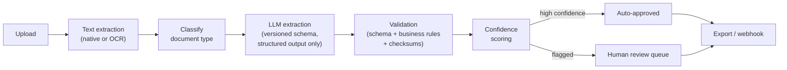

# Docflow

Docflow turns unstructured business documents — invoices, contracts, purchase
orders, receipts — into validated structured data: upload a PDF, image, or
scan; get back typed fields with per-field confidence scores, an audit trail,
and a review queue for anything the system isn't sure about.

## The problem

Extracting a value from a document with an LLM is easy. Extracting a value a
business can trust *without a human re-checking it* is not — that's the actual
engineering problem here, not "which model to call." Most of this codebase is
validation, confidence scoring, and human review, not prompt cleverness. See
[docs/AI.md](docs/AI.md) for that argument in full.

## How it works



- **Extraction** is a structured-output-only LLM call against a versioned
  JSON Schema derived from the same Pydantic models the API returns — the
  model has no tool access and no free-text output channel, so a
  prompt-injection attempt in the document text has no action available to
  it beyond a wrong field value. See
  [docs/SECURITY.md](docs/SECURITY.md#prompt-injection-defense).
- **Validation** is three layers, not one: Pydantic schema validation, then
  business rules (do the line items sum to the total? is the IBAN checksum
  valid? are the dates in order?), then confidence scoring — each layer
  catches a different failure class.
- **Confidence scoring** combines grounding (does the extracted value
  actually appear in the source text?), format cleanliness, validation
  outcome, and OCR-context — not the model's own self-reported certainty,
  which is well known not to be calibrated. See
  [docs/AI.md](docs/AI.md#confidence-scoring).
- **Human review** is the fallback for anything the confidence score doesn't
  clear, not an afterthought bolted onto a demo — the review queue, inline
  correction, and audit trail are first-class frontend surfaces, not an admin
  panel.

Provider-agnostic by design: Anthropic, OpenAI, and Gemini sit behind one
interface (plus a deterministic fixture provider for tests, CI, and
API-key-free demos), swappable with a config change, not a rebuild — see
[docs/AI.md](docs/AI.md).

## Evaluation

Real measurements, not estimates — a 120-document synthetic corpus with
exact ground truth, a rule-based baseline for comparison, and real API calls
against real models:

| | Baseline (rules) | gpt-4.1-mini | gpt-5.6-luna |
|---|---|---|---|
| Field accuracy | 52.1% | **89.8%** | 88.3% |
| Document success | 5.8% | **100.0%** | 100.0% |
| Cost/doc | $0.0000 | $0.0020 | $0.0010 |

**Document success** — every required field correct on the document, not
just the field-accuracy average — is the number that maps to "does a human
have to intervene," and it's what the baseline actually fails on (5.8%): a
deterministic extractor has no shot at nested objects or line items,
regardless of how good its regexes are.

The evaluation harness itself has been through real scrutiny, not just used
to produce a number: two ground-truth bugs were found, root-caused, and
fixed this way — find the problem, prove the root cause with real data (not
a plausible guess), fix the *measurement*, re-measure, add a regression test
so it can't silently come back. Full methodology, what's measured versus
not, and both investigations in detail:
[docs/EVALUATION.md](docs/EVALUATION.md).

## Results

- **297 backend tests** (195 unit + 102 integration, real Postgres,
  transaction-rollback isolation), clean `ruff`/`mypy`/`bandit`, plus 5
  Playwright E2E tests against the real stack.
- **Nine real bugs found and fixed** through actual verification, not
  assumed correct — a non-breaking-space thousands-separator silently
  truncating money values, a currency field artificially inflating the
  review rate, a completely non-functional retry mechanism, a DNS-rebinding
  gap in webhook delivery, two evaluation-corpus ground-truth bugs, and
  three more — see
  [docs/PRODUCTION_READINESS.md](docs/PRODUCTION_READINESS.md) for the full
  list and how each was verified, not just described.
- **Multi-tenant from the schema up**: every table organization-scoped,
  cross-tenant access returns 404 not 403, covered by dedicated tests — see
  [docs/SECURITY.md](docs/SECURITY.md).

## Live demo

No LLM API key required — with none configured, Docflow uses a deterministic
fixture provider that exercises the full pipeline (classification,
extraction, validation, confidence scoring, review routing) without calling
a real model.

```bash
docker compose --profile full up -d --build
docker compose exec api docflow-seed
```

Open **http://localhost:3000/login** with the credentials the seed script
prints (`demo@docflow.dev` / `DocflowDemo2026!`) — the demo account starts
with five documents already processed, one of each built-in document type,
so the dashboard, document list, and review queue aren't empty.

Set `DOCFLOW_LLM_ANTHROPIC_API_KEY`, `DOCFLOW_LLM_OPENAI_API_KEY`, or
`DOCFLOW_LLM_GOOGLE_API_KEY` to run it against a real model instead — see
[docs/LOCAL_DEVELOPMENT.md](docs/LOCAL_DEVELOPMENT.md). The API is at
`http://localhost:8000` (interactive docs at `/docs`); Postgres and Redis run
on non-default host ports (5433, 6380) so they won't collide with anything
already running.

Deployed and live — see [docs/DEPLOYMENT.md](docs/DEPLOYMENT.md) for the URLs.

## Documentation

| Doc | Covers |
|---|---|
| [ARCHITECTURE.md](docs/ARCHITECTURE.md) | System design, request/processing flow, component boundaries |
| [AI.md](docs/AI.md) | Pipeline stages, prompt strategy, provider abstraction, confidence model |
| [DATABASE.md](docs/DATABASE.md) | Schema, multi-tenancy pattern, migrations |
| [API.md](docs/API.md) | Endpoint reference, auth, webhooks, rate limits, error format |
| [SECURITY.md](docs/SECURITY.md) | Threat model, tenant isolation, prompt-injection defense, secrets |
| [EVALUATION.md](docs/EVALUATION.md) | Methodology and **actual measured results** — including what isn't measured yet |
| [LOCAL_DEVELOPMENT.md](docs/LOCAL_DEVELOPMENT.md) | Running it locally, with or without Docker, running tests |
| [DEPLOYMENT.md](docs/DEPLOYMENT.md) | Render/Vercel deployment, environment variables, scaling notes |
| [DECISIONS.md](docs/DECISIONS.md) | Index of architecture decision records, `docs/adr/` |
| [PRODUCTION_READINESS.md](docs/PRODUCTION_READINESS.md) | Line-by-line verified claims, and nine real bugs found along the way |
| [FINAL_REPORT.md](docs/FINAL_REPORT.md) | Product framing, trade-offs, cost model, and a 30+ question interview-style Q&A |

## Tech stack

**Backend:** Python 3.11, FastAPI, SQLAlchemy 2.0 (async), PostgreSQL, Alembic,
`arq` + Redis for the job queue, Pydantic v2, `uv` for dependency management.

**Frontend:** Next.js 15 (App Router), React 19, TypeScript, Tailwind CSS.

**AI:** Anthropic, OpenAI, and Gemini providers behind a shared interface; a
deterministic fixture provider for tests, CI, and API-key-free demos.

**Infra:** Docker (single backend image for API + worker), Docker Compose for
local dev, Render for API/worker/Redis, Vercel for the frontend, GitHub
Actions CI (lint, typecheck, tests against real Postgres/Redis, `bandit` +
`pip-audit` security scans).
