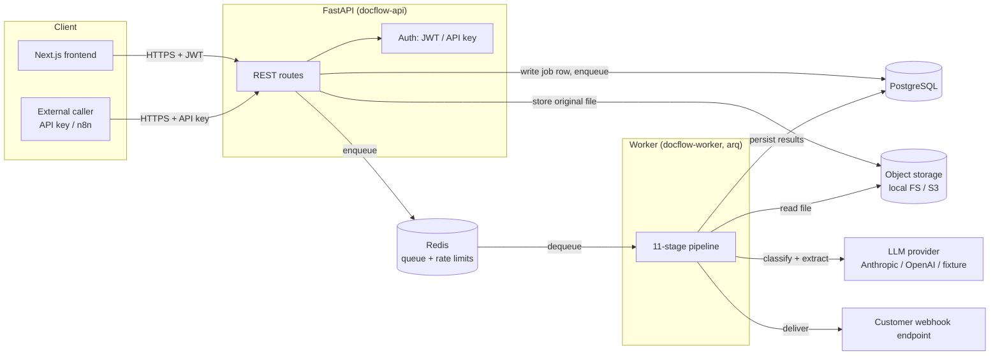
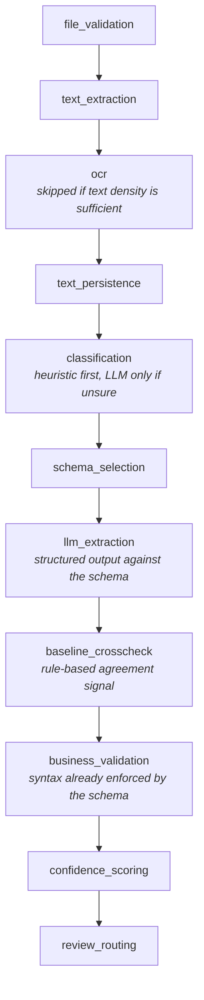

# Architecture

## System overview

Two processes share one codebase and one Docker image
([backend/Dockerfile](../backend/Dockerfile)): the **API** handles synchronous
HTTP concerns (auth, validation, enqueueing, reads), and the **worker** does
the actual document processing off the request path. They communicate only
through Postgres (state) and Redis (the job queue) — never directly.

## Why async processing, not synchronous-in-request

Document processing is composed of OCR, one or more LLM calls, and validation
— realistically 1–10+ seconds, with a long tail (large PDFs, OCR fallback,
LLM retries). Holding an HTTP request open for that is a bad trade twice
over: it ties a request worker to a slow I/O-bound task, and it gives the
client nothing to show a user for several seconds. Upload returns
immediately with a job id; the client polls (`GET /documents/{id}/status`)
or receives a webhook when it's done. See
[ADR-002](adr/002-async-job-queue.md) for the queue technology choice itself.

## Request flow: upload to result

1. `POST /api/v1/documents` — the API validates the file (size, MIME
   sniffing, extension agreement), computes its SHA-256, and checks for an
   existing document with that checksum in the same organization
   (content-addressed dedup). If new, the file is written to object storage
   *before* the database row is inserted — a failed insert after a
   successful write leaks an orphaned object (reclaimed by a lifecycle
   rule); the reverse order risks a row pointing at a file that was never
   written, which is worse (a document permanently stuck, visible in the UI,
   unprocessable).
2. A `documents` row (status `uploaded`, then `queued`) and a
   `processing_jobs` row are created in the same transaction. The job id fed
   to `arq` is `sha256(f"{organization_id}:{idempotency_key}")` — scoped to
   the organization, not just the content hash, because `arq`'s job-id
   uniqueness is a global Redis key. (An earlier version of this hashed only
   the idempotency key; two organizations uploading byte-identical content
   collided and the second organization's document silently never got a
   worker job. See the regression test in
   `backend/tests/unit/test_confidence_and_security.py::TestQueueJobIdTenantIsolation`.)
3. The API returns `202`-equivalent (`200` with `status: "queued"`) with the
   document and job ids. The frontend polls status; API/webhook clients can
   poll or wait for the webhook.
4. The worker picks up the job and runs the pipeline (below), writing
   `processing_steps` rows as it goes so the frontend can render a timeline,
   not just a spinner.
5. On completion, the worker dispatches `document.processed` or
   `document.needs_review` to any webhook endpoints subscribed to that event
   ([API.md](API.md#webhooks)).

## The pipeline

Eleven stages, run in a fixed order by a generic `PipelineRunner` that knows
nothing about what any stage does — the stage list is data
(`backend/src/docflow/pipeline/factory.py`), not a hardcoded call chain. Each
stage records its own timing and outcome as a `processing_steps` row,
independent of whether it succeeds, is skipped, or fails.

**Classification is cheap-first.** A heuristic scorer (keyword/pattern
matching against each registered document type, saturating rather than
linear so one strong signal doesn't require corroboration) runs first; the
LLM is only asked to classify when the heuristic's top score is below a
confidence threshold. Most real documents have unambiguous tells (a receipt
says "receipt"; an invoice has an invoice number field) — most documents
never need an LLM call just to know what they are.

**Validation is three layers, not one:**
1. **Syntax** — enforced by the Pydantic schema the LLM's structured output
   is already constrained to (wrong type, missing required field: the
   extraction itself fails, cheaply, before anything else runs).
2. **Semantic** — cross-field arithmetic (line items sum to the subtotal,
   subtotal + tax = total), date sanity (due date not before issue date),
   and locale-aware parsing of numbers/dates/checksums (IBAN mod-97, Czech
   IČO mod-11, ČNB account checksum).
3. **Business rules** — per-document-type rules from a registry, each
   isolated so one failing rule doesn't take down the rest
   (`backend/src/docflow/validation/`).

**Confidence is multi-signal, not a single model logprob.** Per field, it
combines the extractor's own signal, whether validation passed, whether the
rule-based baseline agrees (skipped when the "LLM" *is* the baseline, i.e.
the fixture provider — otherwise a model would appear to agree with itself
and confidence would be inflated toward 1.0 for the wrong reason), and
whether the field's value is traceable back to the source text
("grounding"). See [AI.md](AI.md#confidence-scoring) for the full model and
why it's not a probability.

**Review routing** is a policy over the scored fields plus the validation
issues, not just a single confidence threshold — a document can be routed to
review because one *specific* required field is below its band, because a
business rule failed outright, or because the extractor and the baseline
disagree on a load-bearing field. Every reason is recorded (`review_reasons`
on the document), not just a boolean, so the frontend can tell a reviewer
*what* to look at instead of "something's uncertain."

## Multi-tenancy

Shared schema, not database-per-tenant or schema-per-tenant — see
[ADR-006](adr/006-multi-tenancy.md) for why, and [DATABASE.md](DATABASE.md)
for the schema itself. The enforcement mechanism is `OrgScopedRepository`: every
repository that touches tenant data is constructed with an `organization_id`
and injects it into every query itself. Route handlers never pass
`organization_id` as a value the caller controls — it comes from the
authenticated principal (JWT claim or API key lookup), never from the URL or
request body. A resource that exists but belongs to another organization
returns `404`, not `403` — a `403` confirms the resource exists, which is
itself information a tenant-isolated system shouldn't leak.

## Storage

Files live in object storage (local filesystem in development and
single-server deployments, S3-compatible in production — one interface,
two implementations, see [ADR-007](adr/007-storage-abstraction.md)), never
as database blobs. Postgres holds metadata, extracted text, and structured
results — the things queried, joined, and validated — not multi-megabyte
binaries that would bloat every backup and slow every unrelated query.

## Observability

Structured JSON logs (`structlog`, unified with stdlib/uvicorn/SQLAlchemy/arq
log output through a single `ProcessorFormatter`) carry `request_id`,
`organization_id`, `document_id`, and `job_id` wherever applicable, so a
single document's path through upload → queue → pipeline stages → webhook
delivery can be reconstructed from logs alone. Prometheus metrics are
exposed at `/metrics` (`docflow/observability/metrics.py`), all with
route/type/provider-template labels — never a document, organization or user
id — to keep cardinality bounded: HTTP request count and latency; documents
processed and review rate by document type; per-stage duration; LLM calls,
tokens, cost and errors by provider/model; job retries and dead-letters by
error code. See [SECURITY.md](SECURITY.md#logging) for what's deliberately
excluded from logs (document contents, credentials).

## What's deliberately not here

- **No Kubernetes.** Two long-running processes and managed Postgres/Redis is
  exactly what Render's service model covers; a control plane and manifests
  would add operational surface with no capability this system currently
  needs. See [ADR-011](adr/011-render-over-kubernetes.md).
- **No message bus beyond the job queue.** There's one asynchronous workload
  (document processing) and one delivery mechanism (webhooks, themselves
  queued through the same Redis). A general event bus would be
  infrastructure in search of a second use case.
- **No microservices.** API and worker are two processes, not two
  deployable-independently services with their own schemas — they share one
  database and one codebase because they're two views onto one workload, not
  two products.
